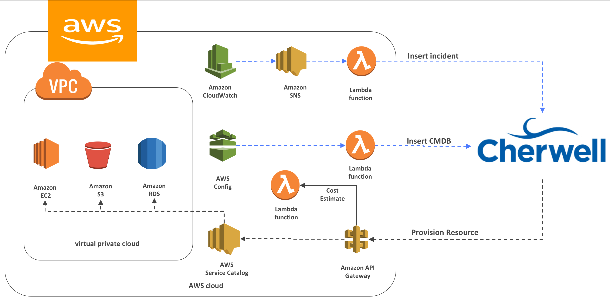

# quickstart-cherwell
## Cherwell intergration on the AWS Cloud

This Quick Start deploys the Cherwell  connector on the AWS Cloud.

Cherwell® Service Management is a powerful, flexible IT service management (ITSM) tool that enables IT teams to implement, automate, and modernize service and support processes to meet new and evolving needs—at a fraction of the cost and complexity associated with legacy ITSM tools.

The Quick Start includes AWS CloudFormation templates to build the AWS infrastructure to connect to your Cherwell deployment using AWS's best practices. By deploying this QuickStart, AWS Config is enable in your AWS account with the recommended Config Rules, and a AWS Service Catalog is created with sample products. 

For architectural details, best practices, step-by-step instructions, and customization options, see the [deployment guide](https://soon).

To post feedback, submit feature ideas, or report bugs, use the **Issues** section of this GitHub repo.
If you'd like to submit code for this Quick Start, please review the [AWS Quick Start Contributor's Kit](https://aws-quickstart.github.io/).

## Usage
To use this QuickStart, you must have an environment with Cherwell Service Manager platform version 9.5 deployed and install the AWS Cherwell connector from the [mApp](https://www.cherwell.com/mapp-exchange/p/browse) exchange.

To build the AWS Lambda funtions:

Install [Golang](https://golang.org/doc/install) and the [AWS Go Sdk](https://aws.amazon.com/sdk-for-go/)

Clone the repo:

    $git clone https://github.com/brianterry/quickstart-cherwell.git

Navigate to: *functions/source*

    $ cd functions/source

Build the lambda functions:

    $ make

Upload all Cloudformation assets to S3.